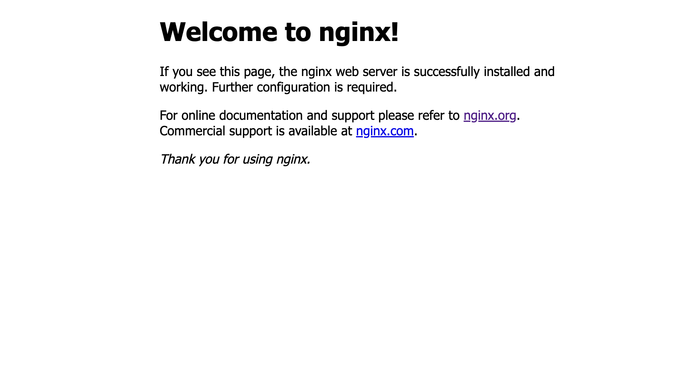

# Docker Hub のイメージをもとにコンテナを作ろう

目次

- [イメージの取得と確認](README.md#イメージの取得と確認)
- [コンテナの起動](README.md#コンテナの起動)
- [コンテナにアクセス](#コンテナにアクセス)

## イメージの取得と確認

Docker イメージを Docker Hub から取得するコマンドは以下のとおりです．

```
#例
$ docker pull <リポジトリ名>:<タグ>
```

`<イメージ名>`には，Docker イメージの種類が入ります．
`<タグ>`は Docker イメージのバージョンを特定します．
比較的，バージョンが直近のものかつ`alpine`とついているものがおすすめです．
今回は`nginx:1.27.0-alpine`というイメージを取得します．

```
$ docker pull nginx:1.27.0-alpine
```

Docker イメージが問題なく取得できたかを確認します．
確認するためのコマンドと出力結果です．

```
$ docker image ls
REPOSITORY      TAG          IMAGE ID       CREATED        SIZE
nginx      1.27.0-alpine   d7cd33d7d4ed   7 weeks ago     44.8MB
```

このように，`nginx`という種類で`1.27.0-alpine`のタグが付いたイメージを取得できています．

## コンテナの起動

先ほど取得した Docker イメージからコンテナを起動します．
コンテナを起動するコマンドは以下です．

```
#例
$ docker container run [option] <リポジトリ名>:<タグ>
```

`リポジトリ名`と`タグ`に先ほど取得したものを入力します．また適宜オプションも指定します．
今回は次のコマンドで起動します

```
$ docker container run -p 8000:80 --name my-nginx-1 nginx:1.27.0-alpine
```

このコマンドの説明をします．`リポジトリ名`と`タグ`は先程のものを指定しています．  
　今回はオプションとして`-p`と`--name`を指定しています．それぞれのオプションについて説明します．  
　`-p`オプションはコンテナのポートとホストマシンのポートをバインド（マッピング）するために使用します．ポートバインドバインディングによりコンテナはホストマシンを超えて外部と通信できます．指定方法は次のとおりです．

```
docker run -p <ホストポート>:<コンテナポート> <リポジトリ>:<タグ>
```

今回はコンテナの`80`番ポートをホストマシンのの`8000`番ポートとして公開しています．つまり，ホストマシンの`8000`番ポートにアクセスが来たとき，コンテナの`80`ポートにリクエストが転送されます．
今回使用している`nginx`は web サーバです．web サーバは http リクエストが来たときに html を返す役割を果たします．http はデフォルトでは`80`番ポートで受け付けるので．コンテナのポートは`80`に指定します．一方ホストマシンでは，自由に使えるポートの中から現在使用されていないポートの番号を指定します．  
　`--name`オプションはコンテナに名前をつけます．起動中のコンテナを確認する際などに役立ちます．以下のように指定します．

```
docker run --name <コンテナ名> <リポジトリ>:<タグ>
```

コンテナが起動しているかを確認しましょう．

```
$ docker container ps
```

このコマンドを入力することで，起動中のコンテナ一覧を確認できます．ここで，`my-nginx-1`という名前のコンテナが起動しているかを確認してください．

## コンテナにアクセス

chrome などのブラウザから<http://localhost:8000>にアクセスしてください.以下の画面が表示されていれば問題なく起動できています．


## その他コマンド

ここまでに紹介したコマンド以外の基本的なコマンドをいくつか紹介します．

### コンテナ停止

```
#例
$ docker container stop <コンテナ名 or コンテナID>
```

試してみましょう．今回は`コンテナ名`を指定します

```
$ docker container stop my-nginx-1
```

コンテナが停止していることを確認します．

```
$ docker container ps
```

出力結果に`my-nginx-1`という名前のコンテナが存在しなければ停止しています．停止したコンテナも含めてコンテナの一覧を表示したい場合は次のコマンドを入力します．

```
$ docker container ps -a
```

出力結果に停止したコンテナが含まれていることを確認してください．

### コンテナ再起動

`docker container stop`コマンドで停止したコンテナを再起動したい場合は次のコマンドを入力します．

```
#例
$ docker container start <コンテナ名 or コンテナID>
```

試してみましょう．今回は`コンテナ名`を指定します．

```
$ docker container start my-nginx-1
```

コンテナが起動しているか確認してください．

## コンテナに命令を送る

起動しているコンテナに対してシェルを通して命令を送る方法について説明します．コマンドは次のとおりです．

```
$ docker container exec [option] <コンテナ名> <コマンド>
```

`<コマンド>`には，実行したいシェルのコマンドを入力してください．先ほど起動したコンテナに対して次のコマンドを試してみましょう．

```
$ docker container exec my-nginx-1 ls
```

`ls`コマンドはディレクトリの中身を表示するコマンドです．ルートディレクトリ直下のディレクトリやファイルが出力されていると思います．色々なコマンドを試してみてください．  
　次に頻繁に使用するコマンドを紹介します．

```
$ docker container exec -it my-nginx-1 /bin/sh
```

`-it`オプションを使用することで対話的なシェルを起動し、リアルタイムでコマンドを入力・実行できます．このときコマンドに`/bin/sh`を指定することで，コンテナに入り，コマンドを実行できます．使用頻度が高いので覚えておいてください．試してみましょう．プロンプトの表示が変わったと思います．この状態で，様々なシェルコマンドを試してみてください．

## NGINX

NGINX（エンジンエックス）とは、オープンソースの Web サーバです．Web サーバとは、ユーザーからのリクエストを受けて処理を実行し、ユーザーにレスポンスを返すためのコンピュータやソフトウェアのことを指します．簡潔に言うと HTML や CSS などの静的ファイルを配信するために使用します．  
　今後のハンズオンを進めるにあたって簡単に NGINX の使い方を説明します．先ほど起動した NGINX のコンテナに対話シェルで入ってください．

```
$ docker container exec -it my-nginx-1 /bin/sh
```

この状態で次のコマンドを入力してください．

```
cat /etc/nginx/conf.d/default.conf
```

NGINX のデフォルトの設定ファイルの中身が開かれます．

```
    location / {
        root   /usr/share/nginx/html;
        index  index.html index.htm;
    }
```

と記された部分がファイルの前半にあります．これは，NGINX にアクセスが来たとき`/usr/share/nginx/html`ディレクトリの`index.html`を返すという意味です．このファイルを探してみましょう．

```
cat /usr/share/nginx/html/index.html
```

出力された HTML ファイルの内容をみると，先ほどアクセスした<http://localhost:8000>と同じであることがわかります．

## コンテナの内容を変更しよう

ここまで作った NGINX のコンテナの内容をコンテナの外部から変更してみましょう．ここで変える内容はコンテナにアクセスしたときり返される HTML ファイルです．ローカルの html フォルダの index.html に変えましょう．次のコマンドで，コンテナ内にローカルのファイルをコピーできます．

```
$ docker cp <ローカルのファイルパス> <コンテナ名>:<コンテナのファイルパス>
```

`<ローカルのファイルパス>`には，現在のディレクトリから，`01/html/index.html`までのファイルパスを指定します．`<コンテナのファイルパス>`は，先ほどの[NGINX](#nginx)セクションで示した，`/usr/share/nginx/html/index.html`を指定します．現在我々がいるディレクトリを`01`としたときは次のコマンドになります．

```
$ docker cp ./html/index.html my-nginx-1:/usr/share/nginx/html/index.html
```

`Successfully copied 2.05kB to my-nginx-1:/usr/share/nginx/html/index.html`のような出力結果が出ると正しく実行されています．<http://localhost:8000>にアクセスしてください．内容が変更されていれば成功です．

## コンテナからイメージを作成

コンテナの内容が変更されましたが，コンテナ内での変更はコンテナを削除すると，消えてしまいます．コンテナの状態を復元しようとしても，作成元のイメージは，pull してきたときの状態のものであるため，コンテナを起動しても自動的には復元されず，再度コンテナに変更を加える必要があります．そのため，いつでも変更後のコンテナを起動できるように，新しいイメージを作り直します．次のコマンドを入力してください．

```
$ docker commit my-nginx-1 my-nginx
```

次のコマンドで`my-nginx`イメージが作成できているかを確認してください．

```
$ docker image ls
```

このイメージを起動し，<http://localhost:8000>にアクセスしてください．変更が残っていれば成功です．

以上で一区切りです．
お疲れ様でした．